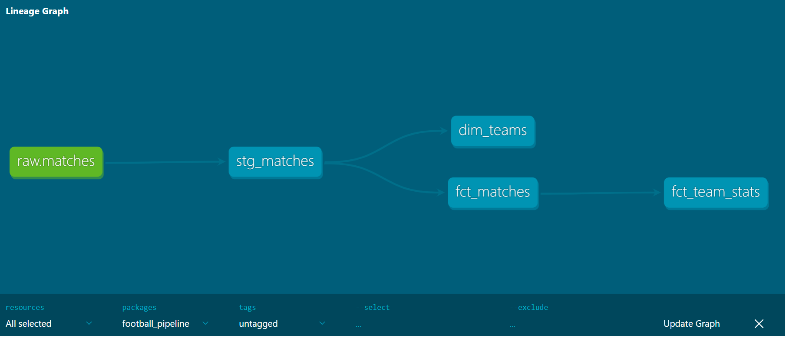

# dbt-football-pipeline
End-to-end ELT pipeline using Python, dbt and DuckDB — ingesting Premier League data from the football-data.org API and transforming it through staging and mart layers.

## Description
`ingest.py` pulls Premier League match data from the football-data.org API, normalises the nested JSON response and loads it into a local DuckDB database. dbt then transforms the raw data through two layers — a staging model that selects, renames and casts the relevant columns, and three mart models: fct_matches (match-level metrics), dim_teams (team reference data) and fct_team_stats (aggregated season stats per team). The final output is a fully tested DuckDB table containing match data for every Premier League game, ready for analysis or visualisation.

## Tech Stack
- **Python** — extracts data from the API, normalises the JSON output and loads it into DuckDB
- **dbt** — models the data through a staging layer (column selection and renaming) and a marts layer (calculated analytical metrics)
- **DuckDB** — local analytical database used to store raw and transformed data
- **football-data.org API** — source of Premier League match and game data

## Architecture


## Project Structure

```
dbt-football-pipeline/
├── scripts/
│   └── ingest.py        # Extracts and loads raw API data into DuckDB
├── football_pipeline/
│   ├── models/
│   │   ├── staging/
│   │   │   ├── stg_matches.sql
│   │   │   └── schema.yml
│   │   └── marts/
│   │       └── fct_matches.sql
│   │       └── dim_teams.sql
│   │       └── fct_team_stats.sql
│   └── dbt_project.yml
├── data/                # DuckDB database files (gitignored)
├── .env                 # API key (gitignored)
└── README.md
```

## How to Run

**1. Clone the repo**
```bash
git clone https://github.com/zinder54/dbt-football-pipeline.git
cd dbt-football-pipeline
```

**2. Create and activate a virtual environment (Python 3.12)**
```bash
py -3.12 -m venv venv
source venv/Scripts/activate
```

**3. Install dependencies**
```bash
pip install dbt-duckdb requests pandas duckdb python-dotenv
```

**4. Add your API key**

Create a `.env` file in the root of the project:

FOOTBALL_API_KEY=your_key_here

**5. Run the ingestion script**
```bash
python scripts/ingest.py
```

**6. Run dbt**
```bash
cd football_pipeline
dbt run
dbt test
```

